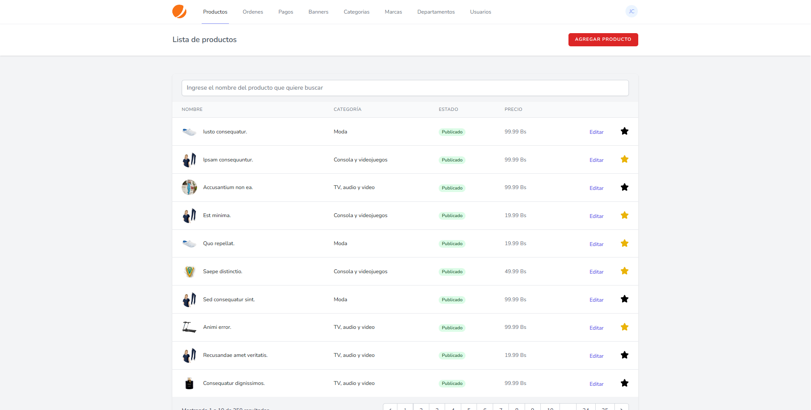
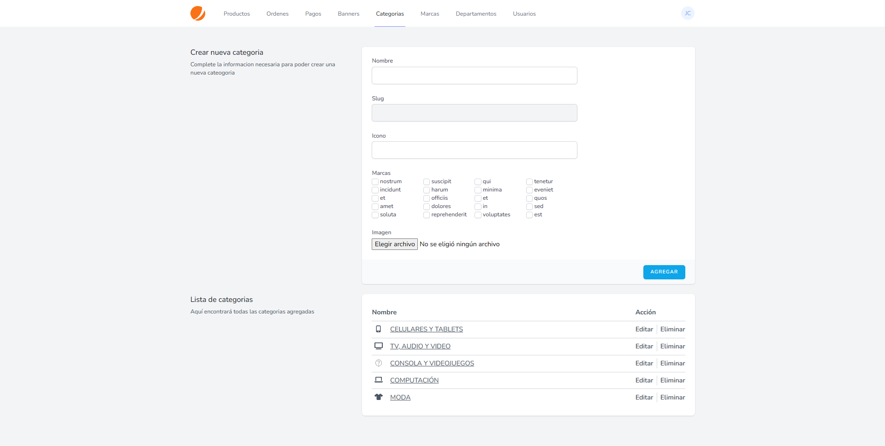

## Ecommerce halleybox

## capturas

1) home
    

2) tienda
    

3) vista de producto
    

4) carrito de compras
    

5) informacion de envío
    

6) checkout
    

7) ordenes clientes
    

8) estado de la orden del cliente
    

9) ADM productos
    

10) ADM detalle de la orden
    

11) ADM categorias
    

12) ADM roles y usuarios
    

